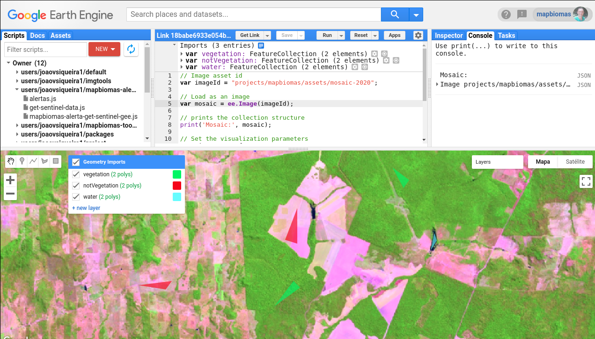
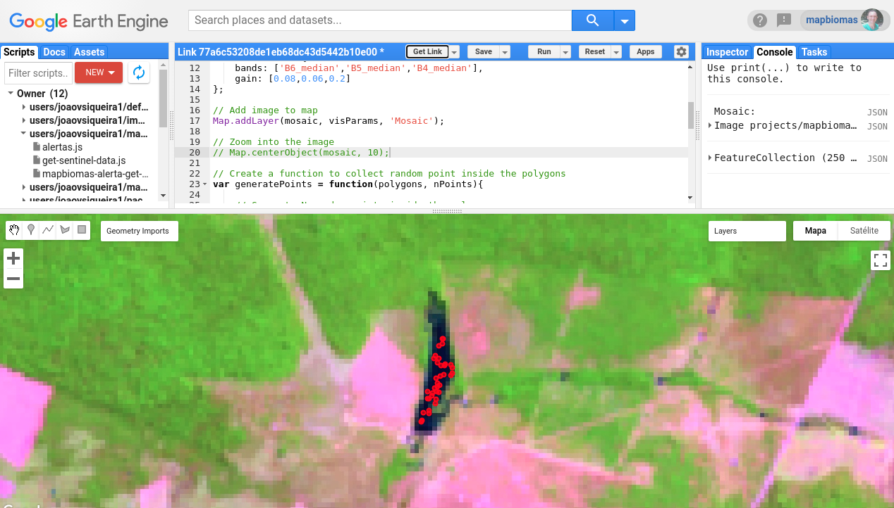
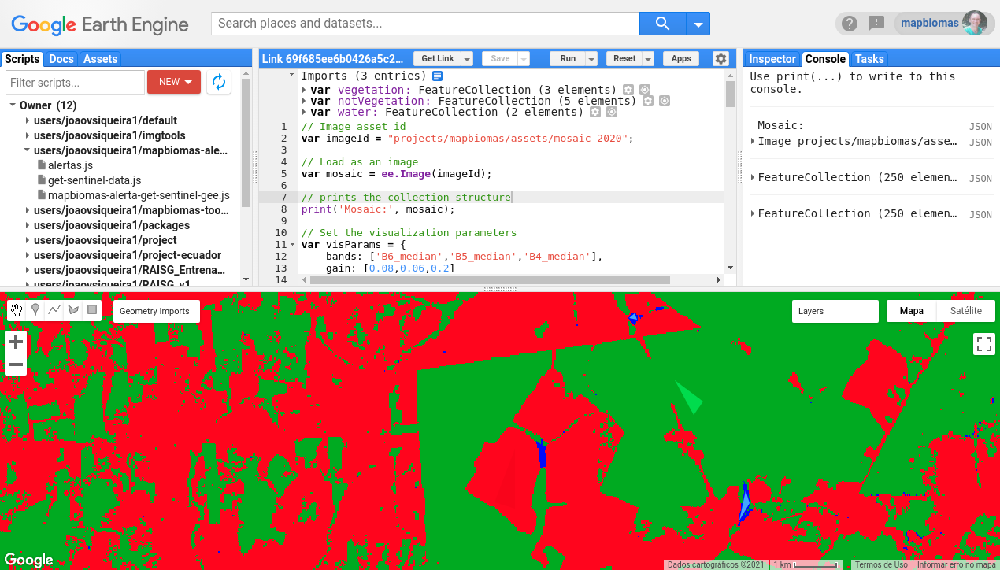

<div class="fluid-row" id="header">
    
    <h1 class="title toc-ignore">MapBiomas Princeton Course</h1>
    <h4 class="author"><em>Tasso Azevedo, Cesar Diniz, Luiz Cortinhas and João Siqueira</em></h4>
</div>
# Concepts of the Day

**Random Forest**: Random Forest is a supervised classifier, made up of decision trees, which uses statistical concepts such as **randomness** and **majority** decision, to add more flexibility to the classifier.

# 2. Classification using Random Forest
Nesta sessão vamos aprender a carregar uma imagem, coletar amostras, treinar um modelo random forest e executar a classifiação.

## 2.1. Load data from asset

### 2.1.1. Load the mosaic as an ee.Image
```javascript
// Image asset id
var imageId = "projects/mapbiomas/assets/mosaic-2020";

// Load as an image
var mosaic = ee.Image(imageId);

// prints the collection structure
print('Mosaic:', mosaic);
```

### 2.2. Add mosaic to map
```javascript
// Set the visualization parameters
var visParams = {
    bands: ['B6_median','B5_median','B4_median'],
    gain: [0.08,0.06,0.2]
};

// Add image to map
Map.addLayer(mosaic, visParams, 'Mosaic');

// Zoom into the image
Map.centerObject(mosaic, 9);
```

<a href="https://code.earthengine.google.com/a0651d74137aec7017cb6c027e17ddd9" target="_blank">Link</a>

## 2.2. Collect manual samples
### 2.2.1. Create a feature collection

Neste exemplo, vamos mapear três classes: `vegetação, não vegetação e água`. Para isso, é necessário coletar amostras para cada uma das classes. Utilizando a ferramenta de edição de polígonos do code editor, vamos criar três conjuntos de geometrias do tipo `polígono` e importá-las como `FeatureCollection`. Também vamos adicionar um nome para cada conjunto de geometrias. O script está preparado para aceitar os nomes: `vegetation`, `notVegetation` e `water`. Em cada conjunto será adicionado uma propriedade chamada `class` que receberá valor 1, 2 ou 3 para vegetation, notVegetation e water respectivamente. Vocês poderão escolher uma cor de referência para cada class. Veja a figura abaixo mostrando o painel de configurações das geometrias:


A coleta das amostras resulta em um conjunto de polígonos semelhante ao que vemos na figura abaixo:


[Link](https://code.earthengine.google.com/18babe6933e054bc7dbc357c255d27b5)

## 2.3. Generate random points

Após a coleta das amostras em formato de polígono, precisamos gerar pontos aleatórios dentro dessas regiões. Isso nos ajuda a ter maior diversidade de amostras. Nesta sessão, apresentamos uma função para coletar os pontos aleatórios dentro dos polígonos que nós desenhamos. 

```javascript
// Create a function to collect random point inside the polygons
var generatePoints = function(polygons, nPoints){
    
    // Generate N random points inside the polygons
    var points = ee.FeatureCollection.randomPoints(polygons, nPoints);
    
    // Get the class value propertie
    var classValue = polygons.first().get('class');
    
    // Iterate over points and assign the class value
    points = points.map(
        function(point){
            return point.set('class', classValue);
        }
    );
    
    return points;
    
};
```

Em seguida, usamos essa função para coletar os pontos em cada grupo de polígonos criado. Observe que a função recebe dois argumentos: `polygons` e `nPoints`. Estes argumentos são respectivamente os `polígonos desenhados` e o `número de pontos que desejamos coletar`. Existe outras formas mais precisas para definir a quantidade de pontos a ser coletados. Por exemplo, podemos definir o tamanho do conjunto de pontos usando como referência a proporção de área conhecida da sua região de interesse `roi`. O objetivo deste tutorial é mostrar uma abordagem introdutória e por isso estamos definindo empiricamente 100 pontos para `vegetation`, 100 pontos para `notVegetation` e 50 pontos para `water`.

```javascript
// Collect random points inside your polygons
var vegetationPoints = generatePoints(vegetation, 100);

var notVegetationPoints = generatePoints(notVegetation, 100);

var waterPoints = generatePoints(water, 50);
```

Para utilizar os pontos no treinamento do classificador é necessário unir os três conjuntos em uma única coleção.

```javascript
// Merge all samples into a featureCollection
var samples = vegetationPoints.merge(notVegetationPoints).merge(waterPoints);

print(samples);

Map.addLayer(samples, {color: 'red'}, 'samples');
```


## 2.4. Collect the spectral information

Uma vez que temos os pontos com as classes definidas, precisamos capturar a informação espectral dos píxeis que tocam os pontos.

```javascript
// Collect the spectral information to get the trained samples
var trainedSamples = mosaic.reduceRegions({
    'collection': samples, 
    'reducer': ee.Reducer.first(), 
    'scale': 30,
  });
  
print(trainedSamples);
```

:heavy_exclamation_mark: Observe o console e veja que, além da propriedade `class`, os pontos possuem agora o valor do pixel de cada banda do mosaico.

<p align="center">
    
</p>

[Link](https://code.earthengine.google.com/db2b9bff4e672fc6f078e3aa6f170383)

## 2.5. Training the Random Forest classifier

```javascript
// Set up the Random Forest classifier
var classifier = ee.Classifier.smileRandomForest({
    'numberOfTrees': 50
});

// Training the classifier
classifier = classifier.train({
    'features': trainedSamples, 
    'classProperty': 'class', 
    'inputProperties': [
        'B2_max',
        'B2_median',
        'B2_min',
        'B3_max',
        'B3_median',
        'B3_min',
        'B4_max',
        'B4_median',
        'B4_min',
        'B5_max',
        'B5_median',
        'B5_min',
        'B6_max',
        'B6_median',
        'B6_min',
        'B7_max',
        'B7_median',
        'B7_min',
        'evi_max',
        'evi_median',
        'evi_min',
        'ndvi_max',
        'ndvi_median',
        'ndvi_min',
        'ndwi_max',
        'ndwi_median',
        'ndwi_min',
    ]
    });
```
[Link](https://code.earthengine.google.com/98f19e617c7ff534db890cff5a3d072e)

## 2.6. Run the classifier

```javascript
// Run the Random Forest classifier
var classification = mosaic.classify(classifier);

// Add classification to map
Map.addLayer(classification, {
        'min': 0,
        'max': 3,
        'palette': 'ffffff,00aa00,ff0000,0000ff',
        'format': 'png'
    },
    'classification'
);
```


[Link](https://code.earthengine.google.com/69f685ee6b0426a5c27ac5007bc4670b)

[Previous: Day 2 - Accessing Satellite Images and Creating Mosaics](https://github.com/mapbiomas-brazil/mapbiomas-training/tree/main/Princeton_University/Day_2/README.md) | [Next: Day 4 - Spatial filter, Temporal Filter and Area Calculation](https://github.com/mapbiomas-brazil/mapbiomas-training/tree/main/Princeton_University/Day_4/README.md)
